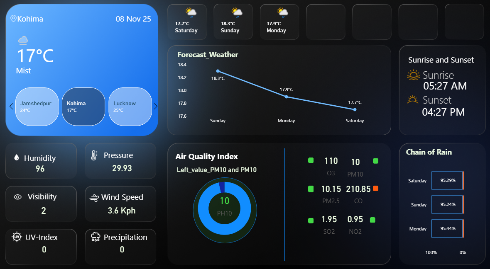

# 🌤️ Weather-Forecast-Dashboard

> A comprehensive real-time weather monitoring dashboard built with Microsoft Power BI



## 📋 Table of Contents
- [About](#about)
- [Features](#features)
- [Getting Started](#getting-started)
- [Data Sources](#data-sources)
- [Usage](#usage)
- [Screenshots](#screenshots)
- [Built With](#built-with)
- [Contributing](#contributing)
- [License](#license)

## 🎯 About

This Power BI dashboard provides real-time weather monitoring and forecasting for multiple cities across India. It displays comprehensive weather metrics including temperature, air quality, precipitation forecasts, and environmental conditions in an intuitive, dark-themed interface.

## ✨ Features

### 🌡️ Real-Time Weather Monitoring
- Current temperature and conditions for primary location
- Multi-city weather comparison (Banaras, Chennai, Mumbai, etc)
- Live updates for weather conditions

### 📊 Comprehensive Metrics
- **Air Quality Index (AQI)** with PM10/PM2.5 monitoring
- **Environmental Data**: Humidity, Pressure, Visibility, Wind Speed
- **UV Index** and **Precipitation** tracking
- **Sunrise/Sunset** times

### 📈 Forecasting
- 3-day temperature forecast with trend visualization
- Hourly forecast data
- "Chain of Rain" precipitation probability tracker

### 🎨 User Interface
- Dark theme for comfortable viewing
- Color-coded indicators (green = good, red = poor)
- Icon-based metric visualization
- Responsive dashboard layout

## 🚀 Getting Started

### Prerequisites
- Microsoft Power BI Desktop (latest version)
- Windows 10/11 operating system
- Active internet connection for data refresh

### Installation

1. **Clone the repository**
   ```bash
   git clone https://github.com/rahul22106/Weather-Forecast-Dashboard.git
   cd weather-dashboard
   ```

2. **Open the Power BI file**
   - Launch Power BI Desktop
   - Open `weather forecasting.pbix`

3. **Configure data sources**
   - Update data source credentials in Power BI
   - Refresh data to load current weather information

### Quick Start

```bash
# Clone the repo
git clone https://github.com/rahul22106/Weather-Forecast-Dashboard.git

# Open in Power BI Desktop
# File > Open > weather forecasting.pbit

# Refresh data
# Home > Refresh
```

## 📊 Data Sources

The dashboard uses the following data tables:

| Table | Description |
|-------|-------------|
| **Measures** | Calculated metrics and KPIs |
| **Current** | Real-time weather data |
| **Forecast_Day** | Daily forecast information |
| **Forecast_hour** | Hourly forecast details |
| **Locations** | Geographic data for cities |

### Data Connection

This dashboard is designed to connect to weather API such as:
- WeatherAPI.com
- Custom weather data endpoints

## 💻 Usage

### Viewing the Dashboard
1. Open the `.pbix` file in Power BI Desktop
2. Click "Refresh" to update with latest data
3. Navigate through pages using page tabs at bottom

### Customization

**Adding New Cities:**
```
1. Go to Data view
2. Update the Locations table
3. Add city name, coordinates, and region
4. Refresh visuals
```

**Modifying Visuals:**
- Click on any visual to see customization options
- Use the Visualizations pane to change chart types
- Adjust colors, fonts, and formatting in Format pane

**Updating Data Refresh:**
- Go to File > Options > Data Load
- Configure automatic refresh intervals

## 📸 Screenshots

### Main Dashboard


### Air Quality Monitor
*Color-coded AQI display with pollutant breakdown*

### Multi-City Comparison
*Real-time weather across multiple locations*

## 🛠️ Built With

- **[Microsoft Power BI](https://powerbi.microsoft.com/)** - Business intelligence and data visualization
- **Power Query** - Data transformation and loading
- **DAX** - Data Analysis Expressions for calculations
- **Weather API** - Real-time weather data source

## 📁 Project Structure

```
weather-dashboard/
│
├── weather-dashboard.pbix    # Main Power BI file
├── README.md                  # This file
├── LICENSE                    # License information
├── Screenshot.png             # Dashboard preview
│

```

## 🤝 Contributing

Contributions are welcome! Please feel free to submit a Pull Request.

1. Fork the project
2. Create your feature branch (`git checkout -b feature/AmazingFeature`)
3. Commit your changes (`git commit -m 'Add some AmazingFeature'`)
4. Push to the branch (`git push origin feature/AmazingFeature`)
5. Open a Pull Request

## 📝 License

This project is licensed under the MIT License - see the [LICENSE](LICENSE) file for details.

## 👤 Author

**Rahul Kumar Mishra**
- GitHub: [@yourusername](https://github.com/rahul22106)
- LinkedIn: [Your Name](www.linkedin.com/in/rahul-kumar-mishra-ba193a330)

## 🙏 Acknowledgments

- Weather data provided by [https://www.weatherapi.com/]
- Icons from [flaticon.com]
- Inspired by modern weather applications

---

⭐ **If you find this project useful, please consider giving it a star!** ⭐
